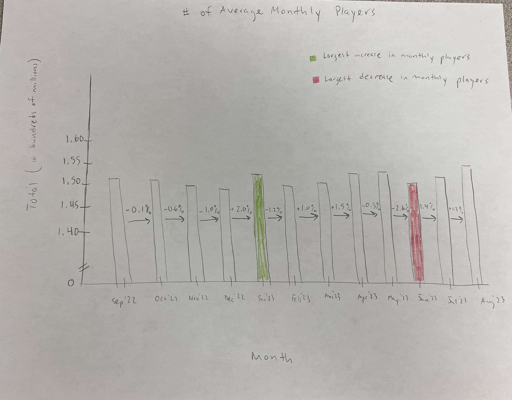

# This is my submission for Assignment 3/4

## Original Data Visualization

Below is the original data visualization that I will be critiquing for my assignment. The image can be found at the following link: 
https://activeplayer.io/league-of-legends-player-base-and-revenue-growth-updated-2023/

I chose to critique and redesign this data visualization because when I first looked at it, I thought, "wow, that's pretty useless." The chart attempts to detail trends in the League of Legends player base. However, it is not very effective. The chart depicts two different pieces of data: average number of monthly players and peak daily players each month. The chart also depicts the number change in average players as well as the percentage change in average players from month to month. These two new values are on such a massively smaller scale that it makes the entire chart hard to read and/or draw accurate conclusions. A redesign of this chart could make its story much more clear for readers interested in League of Legends data (like me!). 

## Step-by-Step Thoughts During Assignment Progress

### Step One: Find a Data Visualization

At first, I wasn't sure what topic I wanted to be the focus for this assignment. I had a couple candidate topics in mind, the first of which is the rise in pickleball growth in the country. As I looked for charts and data around pickleball, I wasn't able to find many charts that were poorly done (which is a good thing in general, but not for this assignment!). Most of the charts I found were quite simple and done in a way that it was easy to understand what the chart was trying to say. I shifted towards a different topic with tons of data, the video game called League of Legends. A simple question I had in mind was: is the playerbase for League of Legends getting bigger or smaller (or staying the same)? I came across the website above relatively quickly and stumbled upon the chart pictured. It showed the data I needed to answer my question, at least in the recent past, but was displayed incredibly poorly. After a bit more searching I was able to find the data used to produce the chart so I decided this would be the focus for this assignment.

### Step Two: Critique the Data Visualization

The google form allowed us to explain our overall thoughts and observations about the visualization itself, its primary audience, and the evaluation method. On this page, I'll discuss my justification for each of the criteria in Stephen Few's [Data Visualization Effectiveness Profile.](http://www.perceptualedge.com/articles/visual_business_intelligence/data_visualization_effectiveness_profile.pdf)

Usefulness Score: 2
Few describes usefulness as a subjective score based on the assessment of the needs and values of others. Even if this chart's target audience is presented with this graph and they are hoping to answer the question this chart is trying to answer, the chart still isn't useful. The bars are placed so close to each other and the scale of the different metrics are so draastically different that a reader is unable to understand trends or patterns from the data. The chart does not facilitate the reader coming to accurate conclusions because the data is presented in a confusing/difficult-to-read way.

Completeness Score: 4
Based on Few's description, this chart is only somewhat complete. Titles and labels are correct, but there is not much context provided that help the reader understand if the data is good, bad, expected, unexpected, etc. The data itself is a timeline of month-to-month comparisons, which (if presented well) help the reader see trends over time. There are also pieces of information presented that are perhaps unnessary, such as including both the number value and percentage value in player change, which detracts from the completeness level.

Perceptibility Score: 4
The information is ultimately not presented in a manner that the human eye and brain can perceive with minimal effort. In other words, it is difficult to actually make out specific values for the different bars in the chart because the scale is way too large, the bars are too close to each other, and the bars are far from the axis values. At a zoomed out glance, the reader can understand the point of the chart, but the reader's eyes must move around too much to discern and align numbers with bars.

Truthfulness Score: 5
For the most part, the chart is truthful and represents what it claims. The bars are proportioned and, though difficult to read, they are created to scale given the axis values and the values in the inherent data. The biggest ding to the truthfulness is the "perentage change" piece of data. No where on the chart scale/axis values is a percentage value listed, so the bars representing the percentage change seem to be included in an arbitrary way. That is, we cannot tell by the scale if the percentage bars are accurate because the scale does not include a percentage value at all.

Intuitiveness Score: 5
The chart is overall intuitive because of its nature as a bar chart and, because of similar points mentioned in the truthfulness section, the bars seem to be proportional and line up with the axis values. A reader can easily understand what the _intent_ of the chart is. Other than the percentage issue mentioned above, the chart is intiuitive and most readers in the chart's target audience would easily be able to understand the goal of the chart.

Aesthetics Score: 2
The aesthetics of this chart are poor, simply put. It is not pleasing to look at because there is just too much going on in too little space. 

Engagement Score: 3
The only aspect of this chart that is engaging is the fact that readers must stare at it for longer than they should need to in order to line up bars with values and draw conclusions from it. Overall, the chart is plain and uninteresting.

### Step 3: Sketch out a Solution

Below is my sketch for how I want to redesign the visualization.

For my sketch, I wanted to eliminate what I felt was the most pressing issue with the original visualization: scale. Including both the number of players as well as the month-to-month change in the same chart (while keeping it proportional) makes it impossible with this data to maintain a scale that is visually appealing and easy to read. Additionally, I felt that this chart can still tell its "story" without the extra bars in the bar chart. So, I removed all the bars except for just the number of monthly players. I also included an arrow between bars indicating the percentage change from month-to-month so this information isn't lost from the original visualization. I kept only the data from the past 12 months as I felt the trends are still able to be understood well enough by the target audience going back that far and removing extra months allows the chart to be smaller and more digestible. Finally, I used green to indicate the bar with the highest percent change in players from the previous month and red to indicate the bar with the lowest percent change in players from the previous month.

### Step 4: Test the Solution

Below is the feedback I received on my sketch:

**Person 1: Student, mid 20's**

- Can you tell me what you think this is?
I think this is a graph of the percent change in players of a game.

- Can you describe to me what this is telling you?
This is telling me that this game is experiencing minimal changes in number of players over time, seeing +/- 2% change at most from month to month. The negatives and positives seem to be pretty similar, with maybe slight overall growth of the game.

- Is there anything you find surprising or confusing?
I’m surprised that the visualization does not tell us which game is in question. Also, because the design uses bars and percent change callouts, it’s not entirely clear how much this game is growing/ shrinking. It takes a lot of effort to compare bar heights, and look at each individual % change value in between the bars. 

- Who do you think is the intended audience for this?
This is likely intended for consumers of this game; people who are interested in its growth (or lack thereof) over time.

- Is there anything you would change or do differently?
I would find a way to highlight the overall trend (growing or shrinking). 2% could be a massive growth if the population if 20000000, but could be small growth if smaller. Consider overlaying this with a spark line that shows the total number of participants so you can see the overall population change over time. 

**Person 2: Student, mid 20's**

- Can you tell me what you think this is?
This graph shows the number of average players by month. I am unsure of players for what activity. 

- Can you describe to me what this is telling you?
This tells my that January had the largest increase in players by a substantial margin. 

- Is there anything you find surprising or confusing?
The fluctuations in player increases/decreases are significant from month to month, why did January increase so much? Why did June decrease so much?

- Who do you think is the intended audience for this?
Readers who are interested in the sport/activity of discussion.

- Is there anything you would change or do differently?
This could just be because its hand drawn, but I think if the y-axis scale was percentage decrease, and the bars were labeled with the value of (XX in Hundreds of Millions of Players), the fluctuations would be more apparent. I like how the largest decrease and increase are color coated.

- Final Thoughts
I think the story is that the number of players fluctuates more than what one would expect, why are specific months drawing such large changes? Is it just coincidence?

**Feedback Conclusion**

After reading through the feedback, I noticed both people commented on how they did not know what game/activity the chart is for, at which point I realized that I completely forgot to include the name of the game in the title of the chart. Additionally, there were comments about ways to more accurately capture the trends over time using something like sparklines. I felt like the comment from Person 2 about changing the y-axis to make fluctuations in values more apparent was interesting and will be something I play around with as I create my visualization.

## Final Data Visualization

Below is my final updated visualization.

<noscript></noscript><object class='tableauViz'  style='display:none;'><param name='host_url' value='https%3A%2F%2Fpublic.tableau.com%2F' /> <param name='embed_code_version' value='3' /> <param name='site_root' value='' /><param name='name' value='TSWD_Assignment3and4&#47;Sheet1' /><param name='tabs' value='no' /><param name='toolbar' value='yes' /><param name='static_image' value='https:&#47;&#47;public.tableau.com&#47;static&#47;images&#47;TS&#47;TSWD_Assignment3and4&#47;Sheet1&#47;1.png' /> <param name='animate_transition' value='yes' /><param name='display_static_image' value='yes' /><param name='display_spinner' value='yes' /><param name='display_overlay' value='yes' /><param name='display_count' value='yes' /><param name='language' value='en-US' /><param name='filter' value='publish=yes' /></object>
                

**Redesign Notes**

My redesign was a combination of my initial sketch and the feedback received from peers in step 4. Specifically, I altered my sketch to utilize my feedback regarding the axes. My initial sketch had the y-axis show the average monthly player count, but I decided to put the percentage change on the y-axis and include the monthly player count as a column label. As in my sketch, I included only the data from the last year as it still tells enough of a story of the changes in player count as it would with all the data from the original. I did away with color in the final sketch because it is easy to see which months had the largest and smallest player count changes as the percentage change is now the value on the y-axis. I altered the title of the visualization to more clearly indicate the game (the title is the same as the orignial visualization). Ultimately, my redesigned visualization is much simpler, easier to look at, and better tells a story than original visualization, allowing the readers to make conclusions and analyses for themselves.
